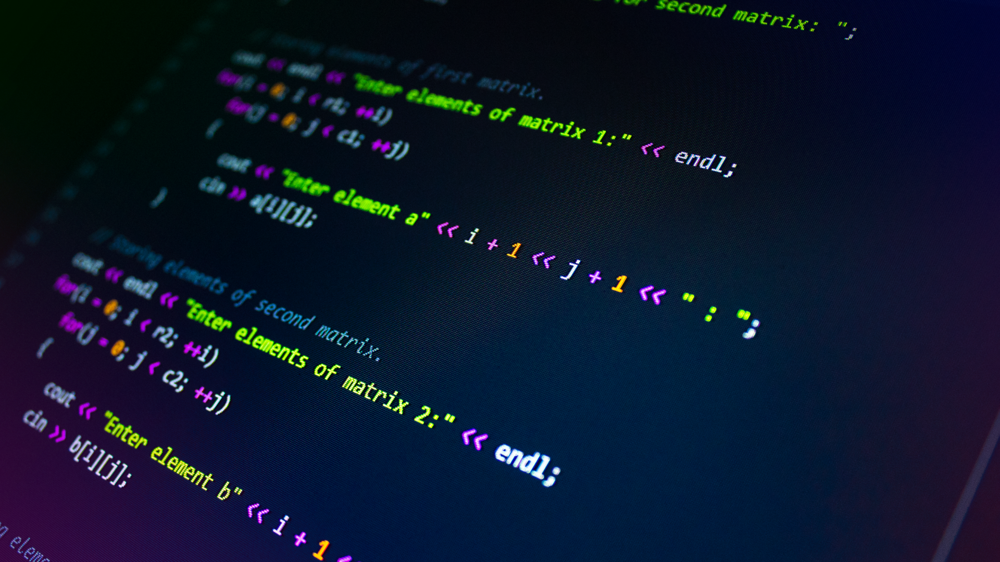

<h1 align="center">
  #boraCodar
</h1>



<p align="center">
  

  

  <a href="https://github.com/amanda-santos/bora-codar-challenges/commits/master">
    
  </a>

  <a href="https://github.com/amanda-santos/bora-codar-challenges/issues">
    
  </a>
</p>

<p align="center">
  <a href="#-about-the-project">About the project</a>&nbsp;&nbsp;&nbsp;|&nbsp;&nbsp;&nbsp;
  <a href="#-challenges">Challenges</a>&nbsp;&nbsp;&nbsp;|&nbsp;&nbsp;&nbsp;
  <a href="#-how-to-contribute">How to contribute</a>&nbsp;&nbsp;&nbsp;
</p>

## 📝 About the project

<p>This is a repository with all of the applications built as challenges of the <a href="https://boracodar.dev/">#boraCodar</a> project. 🚀
</p>

## 👩🏻‍💻 Challenges

<table>
  <tr>
    <th>Project</th>
    <th>Technologies</th>
    <th>Source Code</th>
    <th>Live Preview</th>
  </tr>

  <tr>
    <td>🎵 Music Player</td>
    <td>React, Vite, Typescript, TailwindCSS</td>
    <td>
      <a href="./music-player" target="_blank">
        Link
      </a>
    </td>
    <td>
      <a href="https://bora-codar-1-music-player.vercel.app/" target="_blank">
        Link
      </a>
    </td>
  </tr>

  <tr>
    <td>🛋️ Product Card</td>
    <td>HTML, CSS, Vanilla Javascript</td>
    <td>
      <a href="./product-card" target="_blank">
        Link
      </a>
    </td>
    <td>
      <a href="https://fastidious-biscochitos-394d04.netlify.app/" target="_blank">
        Link
      </a>
    </td>
  </tr>
</table>

## 🤔 How to contribute

**Make a fork of this repository**

```bash
# Fork using GitHub official command line
# If you don't have the GitHub CLI, use the web site to do that.

$ gh repo fork amanda-santos/bora-codar-challenges
```

**Follow the steps below**

```bash
# Clone your fork
$ git clone your-fork-url && cd bora-codar-challenges

# Create a branch with your feature
$ git checkout -b my-feature

# Make the commit with your changes
$ git commit -m 'feat: My new feature'

# Send the code to your remote branch
$ git push origin my-feature
```

After your pull request is merged, you can delete your branch.

---

Made with 💜 by Amanda Santos
