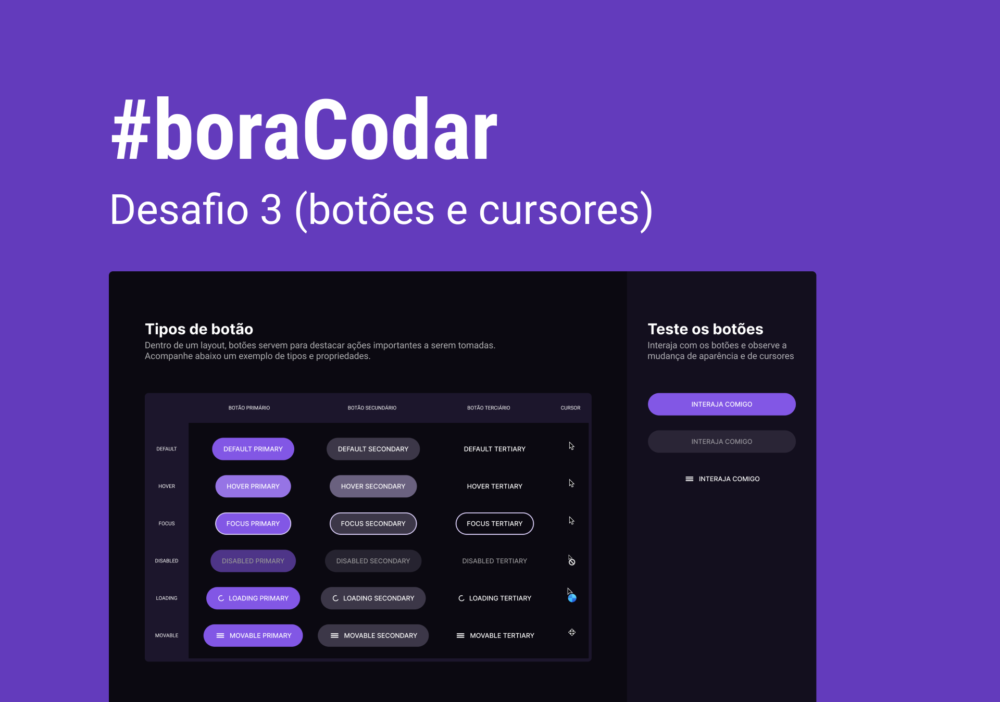

<h1 align="center">
  #boraCodar
</h1>

<h2 align="center">
  Challenge #1: Working with buttons, hover, focus and more 🖱️
</h2>

  <a href="#-about-the-project">About the project</a>&nbsp;&nbsp;&nbsp;|&nbsp;&nbsp;&nbsp;
  <a href="#-layout">Layout</a>&nbsp;&nbsp;&nbsp;|&nbsp;&nbsp;&nbsp;
  <a href="#-technologies">Technologies</a>&nbsp;&nbsp;&nbsp;|&nbsp;&nbsp;&nbsp;
  <a href="#-preview">Preview</a>&nbsp;&nbsp;&nbsp;|&nbsp;&nbsp;&nbsp;
  <a href="#-getting-started">Getting started</a>&nbsp;&nbsp;&nbsp;

## 📝 About the project

This is a project with a table of buttons states and a playground to interact with them. Built for learning purposes. 
 
Developed as the challenge #3 of <a href="https://boracodar.dev/">#boraCodar</a>. 🚀

## 🎨 Layout

  Click <a href="https://www.figma.com/file/YJbyLsGYYuIB1XaOHmg0UG/%23boraCodar---Desafio-3-(Community)?t=ZvcKtjOyC9deAEUU-6">here</a> to check the layout on Figma.

## 👩🏻‍💻 Technologies

Technologies used to develop this project:

- React
- TypeScript
- TailwindCSS
- Vite

## 🖥 Preview

Click <a href="https://bora-codar-3-buttons.netlify.app/" target="_blank">here</a> to see it live. 📺

## ⌨ Getting started

- Run `npm install` to install the dependencies
- Open the application with `npm run dev`

---

Made with 💜 by Amanda Santos
