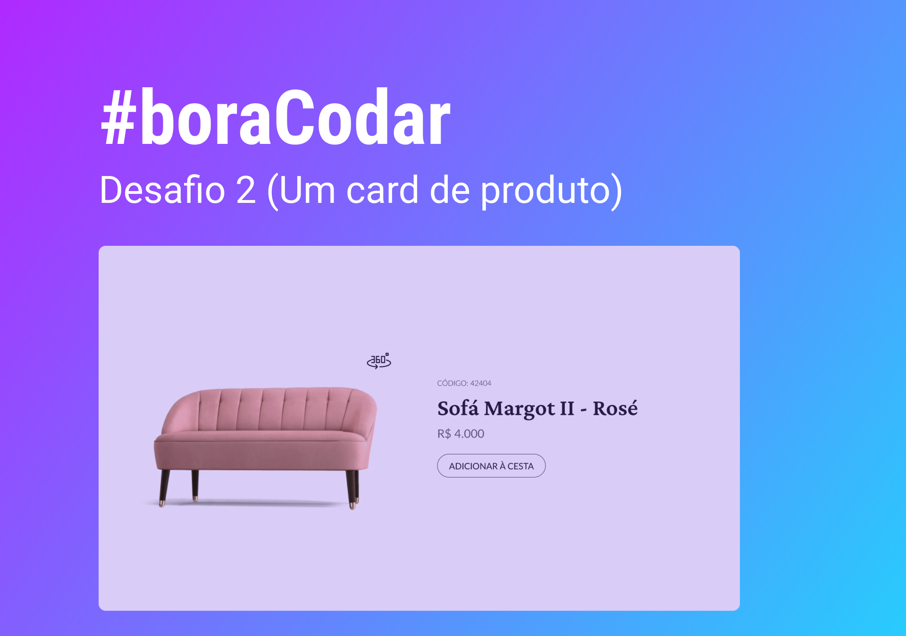

<h1 align="center">
  #boraCodar
</h1>

<h2 align="center">
  Challenge #2: Product Card 🛋️
</h2>

  <a href="#-about-the-project">About the project</a>&nbsp;&nbsp;&nbsp;|&nbsp;&nbsp;&nbsp;
  <a href="#-layout">Layout</a>&nbsp;&nbsp;&nbsp;|&nbsp;&nbsp;&nbsp;
  <a href="#-technologies">Technologies</a>&nbsp;&nbsp;&nbsp;|&nbsp;&nbsp;&nbsp;
  <a href="#-preview">Preview</a>&nbsp;&nbsp;&nbsp;|&nbsp;&nbsp;&nbsp;
  <a href="#-getting-started">Getting started</a>&nbsp;&nbsp;&nbsp;

## 📝 About the project

This is a product card built for learning purposes. 
 
Developed as the challenge #2 of <a href="https://boracodar.dev/">#boraCodar</a>. 🚀

## 🎨 Layout

  Click <a href="https://www.figma.com/file/CEpr3vblzZcaqW1ziDNVbH/%23boraCodar---Desafio-2-(Community)?t=xJ5dUtLuRw06ISq5-6">here</a> to check the layout on Figma.

## 👩🏻‍💻 Technologies

Technologies used to develop this project:

- HTML
- CSS
- Vanilla Javascript

## 🖥 Preview

Click <a href="https://fastidious-biscochitos-394d04.netlify.app/" target="_blank">here</a> to see it live. 📺

## ⌨ Getting started

- Run `npm install` to install the dependencies
- Open the application with `npm run dev`

---

Made with 💜 by Amanda Santos
